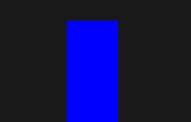
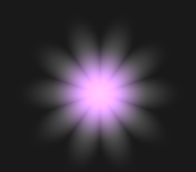
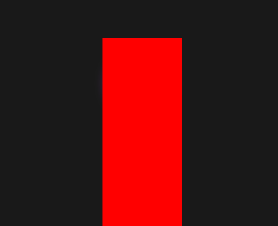
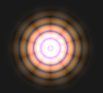
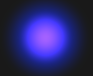
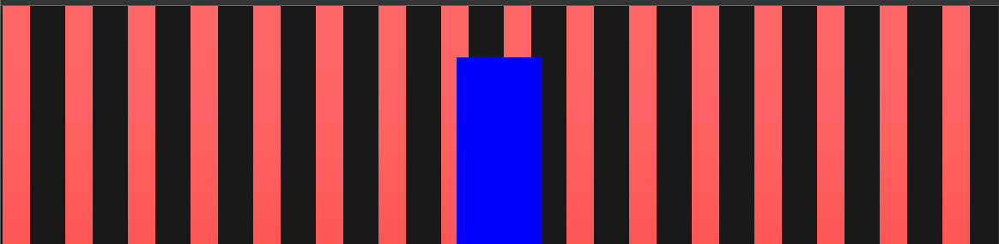

# 🧩 Exercice d'interaction avec un shader

## ⚙️ Installation du projet

1. **Cloner le projet**
   ```bash
   git clone https://github.com/nom-du-repo.git
   cd nom-du-repo
   ```

2. **Installer les dépendances**
   ```bash
   npm install
   ```

3. **Lancer le serveur de développement**
   ```bash
   npm run dev
   ```

4. **Ouvrir le projet dans le navigateur**
   ```
   http://localhost:5173/
   ```

---

## 📁 Où trouver le code

Le code à recréer se trouve dans le fichier :

```
src/App.vue
```

Cherchez la fonction :

```js
function onShaderReady() {
  // ...
}
```

Vous allez la reconstruire étape par étape à partir des questions ci-dessous.

---

# Exercice : Les Event Listeners en JavaScript

Dans cet exercice, vous allez apprendre à utiliser les **event listeners** pour créer des interactions utilisateur. Le shader est déjà configuré - concentrez-vous uniquement sur les événements JavaScript.

## Contexte de départ

Vous avez déjà cette fonction de base :

```javascript
function onShaderReady() {
  console.log('Shader is ready!', bg.value.getMaterial())
  const mat = bg.value.getMaterial()
  const uniforms = mat.uniforms
  let theCube = document.getElementById("theCube")

  // Gestion du mouvement de la souris (déjà implémenté)
  window.addEventListener('pointermove', onPointerMove, { passive: true })

  // Vos événements à créer ci-dessous...
}
```

**Note :** La variable `timeout` est déjà définie ailleurs dans votre code.

---

## Question 1 : Événements sur un élément spécifique





Ajoutez trois event listeners sur l'élément `theCube` :

1. **Au clic** : Changer la couleur de fond en jaune
2. **Quand la souris entre** sur l'élément : Changer la couleur de fond en rouge
3. **Quand la souris sort** de l'élément : Changer la couleur de fond en bleu

<details>
<summary>💡 Indices (cliquez pour afficher)</summary>

- Utilisez `addEventListener()` sur `theCube`
- Les événements sont : `'click'`, `'pointerenter'`, `'pointerleave'`
- Modifiez `theCube.style.backgroundColor`

</details>

---

## Question 2 : Double-clic sur la fenêtre



Créez un event listener qui détecte le **double-clic** n'importe où sur la page :

- Quand l'utilisateur double-clique, mettez `uniforms.uDblClick.value` à `1.0`
- Après un délai (utilisez la variable `timeout`), remettez cette valeur à `0.0`

<details>
<summary>💡 Indices (cliquez pour afficher)</summary>

- L'événement s'appelle `'dblclick'`
- Utilisez `setTimeout()` pour le délai
- Utilisez une fonction fléchée pour réinitialiser la valeur

</details>

---

## Question 3 : Appuyer et relâcher la souris



Créez deux event listeners sur `window` :

1. **Quand on appuie** sur le bouton de la souris : Mettre `uniforms.uMouseDown.value` à `1.0`
2. **Quand on relâche** le bouton :
    - Remettre `uniforms.uMouseDown.value` à `0.0`
    - Mettre `uniforms.uMouseUp.value` à `0.5`
    - Après un délai, remettre `uniforms.uMouseUp.value` à `0.0`

<details>
<summary>💡 Indices (cliquez pour afficher)</summary>

- Les événements sont : `'pointerdown'` et `'pointerup'`
- Pour `'pointerup'`, vous avez plusieurs actions à faire dans la même fonction

</details>

---

## Question 4 : Appuyer et relâcher une touche du clavier



Créez deux event listeners sur `window` pour détecter les touches du clavier :

1. **Quand on appuie** sur une touche : Mettre `uniforms.uKeyDown.value` à `1.0`
2. **Quand on relâche** une touche :
    - Remettre `uniforms.uKeyDown.value` à `0.0`
    - Mettre `uniforms.uKeyUp.value` à `1.0`
    - Après un délai, remettre `uniforms.uKeyUp.value` à `0.0`

**Indices :**
- Les événements sont : `'keydown'` et `'keyup'`
- La structure est similaire à la Question 3

---

## Question 5 : Défilement de la page (scroll)


Créez un event listener qui détecte le **défilement** de la page et calcule la position du scroll :

- Calculez la hauteur maximale de défilement : `document.body.scrollHeight - window.innerHeight`
- Calculez la position actuelle : `window.scrollY / scrollMax`
- Stockez cette valeur dans `uniforms.uScroll.value`

**Indices :**
- L'événement s'appelle `'scroll'`
- Créez d'abord la variable `scrollMax`
- Puis calculez `scrollPos` en divisant la position actuelle par le maximum
- La valeur sera entre 0 (haut de la page) et 1 (bas de la page)

---

## Bonus : Testez votre code !

Une fois tous les événements ajoutés, testez-les :
- Cliquez sur le cube
- Passez la souris dessus
- Double-cliquez sur la page
- Appuyez et relâchez la souris
- Appuyez sur des touches du clavier
- Faites défiler la page

Observez comment le shader réagit à vos interactions !